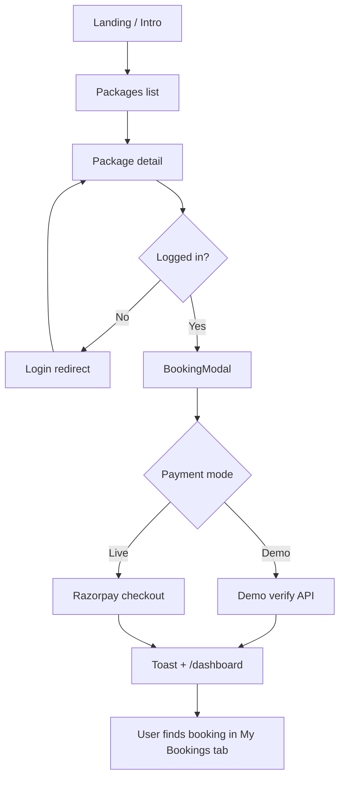

# XOXO.TRAVEL — Launch Candidate Report

_Complete launch review · 2026-06-25 · No new features in scope_

---

## Executive summary

| Dimension | Score | Verdict |
|-----------|-------|---------|
| Core booking flow | 7/10 | Functional end-to-end in demo; live payments require keys |
| UX polish | 6/10 | Strong cinematic entry; friction at confirmation and social proof |
| Responsive design | 8/10 | Mobile-first patterns; minor z-index overlaps |
| SEO & discoverability | 4/10 | Basic titles; missing OG, sitemap, structured data |
| Legal & compliance | 1/10 | **No legal pages** — launch blocker |
| PWA & assets | 5/10 | SVG icon + manifest; no PNG maskable icons or OG images |
| Analytics | 0/10 | **Not integrated** |
| Production integrations | 8/10 | Provider layer ready; keys required at deploy |
| Automated QA | 10/10 | 53/53 API tests passing |

**Overall launch readiness: 62/100 — Launch Candidate (LC), not GA-ready.**

Suitable for **controlled beta** with live API keys and legal pages added. **Not suitable for unrestricted public launch** until P0 items in `FINAL_TODO.md` are resolved.

---

## 1. User flow review

### Primary path: Landing → Booking confirmation

```
/ (CinematicHero + intro)
  → search or browse
/packages (PackagesBrowser)
  → /packages/[id] (PackageDetail)
  → Login required (toast + redirect if unauthenticated)
  → BookingModal (3 steps: date → contact → review + pay)
  → Razorpay checkout OR demo verify
  → Toast + redirect to /dashboard (Overview tab)
```

| Step | Status | Notes |
|------|--------|-------|
| Landing / intro | ✅ Strong | 5.5s cinematic; skippable; first-visit only; poster fallback |
| Search → packages | ✅ Works | Hero search uses `?q=`; packages page debounces search |
| Package browse | ✅ Works | Filters, sort, skeleton loading |
| Package detail | ✅ Works | Skeleton, sticky mobile CTA, wishlist |
| Auth gate | ⚠️ Friction | No guest checkout; login redirect loses momentum |
| Booking modal | ✅ Works | 3-step flow; validation on each step |
| Payment | ⚠️ Demo risk | Demo message visible when Razorpay keys absent |
| Confirmation | ❌ Gap | **No confirmation page** — toast only, lands on dashboard Overview |

### Secondary paths

| Path | Status |
|------|--------|
| Signup → dashboard | ✅ Works; no terms acceptance |
| AI Planner | ✅ Works; demo mode without Anthropic key |
| Visa assistant | ✅ Works |
| Dashboard → My Bookings | ✅ Works; user must switch tab after payment |
| Social (match, chat, groups) | ✅ Functional; auth required |

### Flow diagram



---

## 2. UX friction

| Severity | Issue | Location |
|----------|-------|----------|
| **High** | No booking confirmation screen — success is a toast; user lands on Overview, not My Bookings | `BookingModal.tsx` L76–78, L105–107 |
| **High** | Login required before booking with no inline auth | `PackageDetail.tsx` |
| **High** | Demo payment toast: `"Booking confirmed! (demo payment) 🎉"` visible in production without keys | `BookingModal.tsx` L76 |
| **Medium** | Recently Booked cards link to `/packages`, not specific packages | `RecentlyBookedSection.tsx` L75 |
| **Medium** | Duration package cards filter by duration only, not package ID | `PackagesByDuration.tsx` |
| **Medium** | Intro hides navbar (`opacity-0 pointer-events-none`) until skip/complete | `Navbar.tsx` |
| **Medium** | Cancel booking is one-click with no confirmation | `DashboardClient.tsx` |
| **Medium** | Phone optional on signup but required (≥10 digits) in booking | `signup/page.tsx` vs `BookingModal.tsx` |
| **Low** | Add-ons (Insurance, Visa) shown on step 3 as "Coming soon" | `BookingModal.tsx` L200–222 |
| **Low** | `PlanWithXOXO` loads with `ssr: false` and no loading fallback | `app/page.tsx` L54–57 |

---

## 3. Missing loading states

| Area | Current | Gap |
|------|---------|-----|
| Packages list | ✅ Skeleton cards | — |
| Package detail | ✅ Pulse skeleton | — |
| Home destination API | ⚠️ Silent omit on failure | No error message if API down |
| Dashboard | ⚠️ Text spinner only | No skeleton for bookings list |
| Booking step 3 | ✅ Button spinner | `setSubmitting(false)` before Razorpay modal closes — button re-enables |
| Auth hydration | ⚠️ Generic "Loading your account…" | `RequireAuth.tsx` |
| PlanWithXOXO | ❌ No fallback | Empty until client hydrates |
| Home sections | ✅ `SectionFallback` skeletons | — |

---

## 4. Confusing copy

| Copy | Issue | File |
|------|-------|------|
| `"Booking confirmed! (demo payment) 🎉"` | Exposes internal demo state to users | `BookingModal.tsx` |
| `"Is the API running?"` | Developer-facing error in production UI | `PackagesBrowser.tsx` L92 |
| `"Itinerary coming soon."` | Empty itinerary on package detail | `PackageDetail.tsx` |
| Maldives quote → `"Prameet Roy, Vietnam"` | **Destination mismatch** in featured review | `WhyChooseUs.tsx` L82–85 |
| `"143+ trips booked last week"` | Static social proof presented as live metric | `RecentlyBookedSection.tsx` L42 |
| `"Awarded — The Best International Holiday Brand in India"` | Unsubstantiated award claim | `WhyChooseUs.tsx` L65–67 |
| Insurance / Visa add-ons on final step | Shown but disabled — sets false expectation | `BookingModal.tsx` |

---

## 5. Branding inconsistencies

| Element | Variants found | Files |
|---------|----------------|-------|
| Product name | `XOXO.TRAVEL` · `xoxotravel` · `XOXO Travels` | `CinematicHero.tsx`, `Navbar.tsx`, `Footer.tsx`, `layout.tsx` |
| Traveller count | **2 Lakh+** · **150k+** | `layout.tsx`, `Footer.tsx`, `signup/page.tsx` vs `pyt-data.ts` WHY_CHOOSE_STATS |
| Google rating | **4.6** (8250 reviews) · **4.8/5** | `CinematicHero.tsx`, `WhyChooseUs.tsx` vs `home-data.ts` TRUST_SIGNALS |
| Review count | 8250 · 8250+ | Hero vs WhyChooseUs |
| CSS namespace | `pyt-*` (PickYourTrail-style) | `globals.css`, `Navbar.tsx`, `CinematicHero.tsx` |
| AI persona | **Trippie** (chat) vs **Plan with XOXO** (button) | `PlanWithXOXO.tsx` |
| Tagline | `Book. Meet. Travel.` (intro) vs `Sooper Hit Holiday` (hero) | Both intentional but dual-brand messaging |
| Manifest description | `"India's Social Travel Super-App"` | `manifest.json` — not aligned with holiday-package positioning |

**Recommendation:** Publish a one-page brand sheet: canonical name `XOXO.TRAVEL`, wordmark rules, single traveller stat, single rating source.

---

## 6. Responsive behavior

### Desktop (≥1024px)

- ✅ Container-x layout, multi-column grids, hover states
- ✅ Navbar full search pill + dropdowns
- ✅ Footer two-column layout
- ⚠️ Cinematic hero search and homepage hero search are duplicate UX layers post-intro

### Tablet (768–1023px)

- ✅ Recently Booked switches to stacked layout (`lg:flex-row`)
- ✅ Package grids 2-column
- ⚠️ Mobile bottom nav hidden (`md:hidden`) — tablet uses desktop nav only; acceptable

### Mobile (<768px)

- ✅ `100dvh` hero, safe-area padding on nav and Trippie FAB
- ✅ 56px bottom nav, 44px touch targets
- ✅ Booking modal slides from bottom (`items-end`)
- ✅ Sticky package CTA bar
- ⚠️ **Z-index overlap**: package sticky bar `z-40` = `MobileNav` `z-40` — may compete on package detail
- ⚠️ Trippie FAB `z-50` can overlap sticky CTA on scroll
- ✅ Horizontal scroll carousels with snap (`snap-x`)

---

## 7. SEO metadata

### Root (`app/layout.tsx`)

| Field | Status |
|-------|--------|
| `title` | ✅ |
| `description` | ✅ |
| `metadataBase` | ❌ Missing |
| `openGraph` | ❌ Missing |
| `twitter` | ❌ Missing |
| `robots` | ❌ Missing |
| `alternates.canonical` | ❌ Missing |

### Page-level metadata

| Route | Title | Description | Dynamic |
|-------|-------|-------------|---------|
| `/` | Inherits root | Inherits root | ❌ |
| `/packages` | ✅ | ✅ | — |
| `/packages/[id]` | ✅ Static | ✅ Static | ❌ No `generateMetadata` |
| `/destinations` | ✅ | ✅ | — |
| `/destinations/[slug]` | ❌ | ❌ | ❌ High-value gap |
| `/login`, `/signup` | ❌ | ❌ | Client components |
| Social/auth pages | Title only | ❌ No description | — |

**No `generateMetadata` anywhere in the codebase.**

---

## 8. Structured data

**Status: ❌ Not implemented**

No JSON-LD (`Organization`, `WebSite`, `Product`, `TouristDestination`, `BreadcrumbList`).

Recommended minimum for launch:
- `Organization` + `WebSite` on root
- `Product` or `TouristTrip` on `/packages/[id]`
- `TouristDestination` on `/destinations/[slug]`

---

## 9. Open Graph metadata

**Status: ❌ Not configured**

- No `openGraph` or `twitter` in metadata exports
- No `app/opengraph-image.*` convention files
- `public/og/` contains README only — **no image assets shipped**
- `MARKETING_ASSETS.md` specifies 1200×630 — assets not produced

**Impact:** Poor or missing link previews on WhatsApp, iMessage, LinkedIn, X.

---

## 10. Favicon, PWA, robots, sitemap

| Asset | Path | Status |
|-------|------|--------|
| SVG icon | `public/icon.svg` | ⚠️ Placeholder "X" on gradient |
| `favicon.ico` | — | ❌ Missing |
| PNG PWA icons (192, 512) | `public/logos/favicon/` | ❌ README only |
| Apple touch icon (180 PNG) | — | ❌ SVG only |
| Manifest | `public/manifest.json` | ⚠️ SVG-only icons; `portrait-primary` may limit tablet PWA |
| `robots.txt` | — | ❌ No `app/robots.ts` or `public/robots.txt` |
| `sitemap.xml` | — | ❌ No `app/sitemap.ts` |
| Service worker | — | ❌ None (install-only PWA) |
| Custom 404 | — | ❌ No `app/not-found.tsx` |

---

## 11. Legal pages

| Page | Route | Status |
|------|-------|--------|
| Privacy Policy | `/privacy` | ❌ **Does not exist** |
| Terms & Conditions | `/terms` | ❌ **Does not exist** |
| Refund Policy | `/refund` | ❌ **Does not exist** |
| Cookie Policy | `/cookies` | ❌ **Does not exist** |

- Footer has **no legal links** (`components/layout/Footer.tsx`)
- Signup has **no terms/privacy checkbox** (`signup/page.tsx`)
- Refund exists only as **payment API** (`POST /api/payments/refund`), not customer-facing policy

**Verdict: Launch blocker for public release in India (DPDP Act, consumer protection, Razorpay compliance).**

---

## 12. Analytics integration

**Status: ❌ Not planned or implemented**

| Tool | Status |
|------|--------|
| Google Analytics 4 | ❌ |
| Google Tag Manager | ❌ |
| Plausible / PostHog / Mixpanel | ❌ |
| Vercel Analytics | ❌ |
| Sentry / App Insights | ❌ (noted in `LAUNCH_CHECKLIST.md`) |

No `<Script>` tags in `app/layout.tsx`. No analytics env vars in `.env.example`.

**Recommendation:** Add GA4 or Plausible before launch for conversion funnel (landing → package → booking → payment).

---

## 13. Debug code & placeholder content

### Clean ✅

- No `console.log` / `TODO` / `FIXME` in `app/`, `components/`, `lib/` (verified)
- Dev login credentials hidden in production (`LoginForm.tsx` L88–91, `NODE_ENV === "development"`)

### Remaining placeholder / demo content

| Item | Risk | Location |
|------|------|----------|
| Demo payment flow + user-facing message | **High** in prod without Razorpay | `BookingModal.tsx`, `payment.controller.js` |
| Static RECENT_BOOKINGS ticker | Medium — presented as live | `lib/pyt-data.ts`, `RecentlyBookedSection.tsx` |
| Hardcoded MATCH_PROFILES | Medium | `TravelMatchPreview.tsx` |
| DURATION_PACKAGES static data | Low — links to filtered list | `PackagesByDuration.tsx` |
| Testimonial location error | Medium — credibility | `WhyChooseUs.tsx` |
| Legacy unused components | Low — not imported | `Hero.tsx`, `layout/Navbar.tsx`, `lib/mock-data.ts` |
| `icon.svg` placeholder | Low | `public/icon.svg` |
| Intro video files | Expected | `public/videos/` — poster only until launch assets added |
| Seeded demo user | Dev/staging only | `backend/src/seed.js` — disable in production DB |

---

## Production integration status

From Live Integration Sprint (`GET /api/inventory/status`):

| Integration | Code ready | Keys required |
|-------------|--------------|---------------|
| Amadeus (flights/hotels/activities) | ✅ | `AMADEUS_API_KEY/SECRET` |
| Google Maps | ✅ | `GOOGLE_MAPS_API_KEY` |
| Razorpay | ✅ | `RAZORPAY_KEY_ID/SECRET/WEBHOOK` |
| Resend | ✅ | `RESEND_API_KEY` |
| Cloudinary | ✅ | `CLOUDINARY_*` |

See `docs/integrations/README.md`.

---

## Launch candidate verdict

### Ready for LC (controlled beta)

- Core package booking flow (demo or live payments)
- Auth, dashboard, social features
- Cinematic brand experience
- Backend integrations with mock fallback
- 53/53 automated API tests

### Not ready for GA (general availability)

| Blocker | Category |
|---------|----------|
| Legal pages (privacy, terms, refund, cookies) | Compliance |
| Live Razorpay keys + webhook on production domain | Payments |
| Production backend + MongoDB deployed | Infrastructure |
| OG images + `metadataBase` + sitemap/robots | SEO / sharing |
| Analytics | Measurement |
| Brand stat alignment + demo copy removal | Trust |
| PNG PWA icons | Install experience |

---

## Related documents

| Doc | Purpose |
|-----|---------|
| `FINAL_TODO.md` | Prioritized pre-launch action list |
| `LAUNCH_CHECKLIST.md` | Prior audit (2026-06-24) |
| `MARKETING_ASSETS.md` | OG/icon specs |
| `docs/integrations/README.md` | API key setup |
| `PROJECT_STATUS.md` | Engineering status |
| `DEPLOYMENT_GUIDE.md` | Deploy steps |

---

_Audit performed without code changes. See `FINAL_TODO.md` for actionable next steps._
